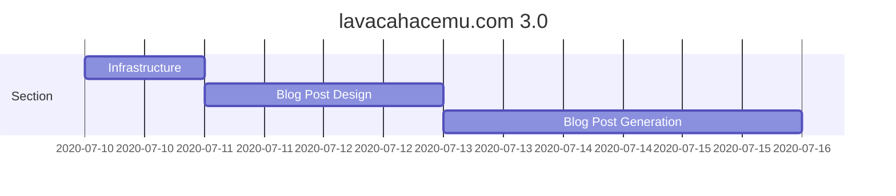

# lavacahacemu.com

This project was generated with [Angular CLI](https://github.com/angular/angular-cli) version 11.1.1.
## Description
This blog was started in blogger some  15 years ago, now without blogger support it has been hosted on github pages with static html generation through hexo. In an attempt to keep the blog _modern_, a decision was made to part from the hexo-generated project and start a new one that will parse images, converting into the different needs and the markup/json/yaml (maybe) into html that falls back on to use different image sources, for example.

## Features
Here's a list of features that will be worked on, I mean, if you're here, it means you're interested in the development features.

1. Static page generation from json+markdown
1. Support for "modern" web features
    1. Responsive UI
    1. Multiple images
1. Search
1. Auto-deployment to gh-pages

## Development server

Run `ng serve` for a dev server. Navigate to `http://localhost:4200/`. The app will automatically reload if you change any of the source files.

## Code scaffolding

Run `ng generate component component-name` to generate a new component. You can also use `ng generate directive|pipe|service|class|guard|interface|enum|module`.

## Build

Run `ng build` to build the project. The build artifacts will be stored in the `dist/` directory. Use the `--prod` flag for a production build.

## Running unit tests

Run `ng test` to execute the unit tests via [Karma](https://karma-runner.github.io).

## Running end-to-end tests

Run `ng e2e` to execute the end-to-end tests via [Protractor](http://www.protractortest.org/).

## Further help

To get more help on the Angular CLI use `ng help` or go check out the [Angular CLI Overview and Command Reference](https://angular.io/cli) page.

