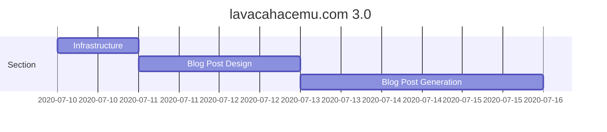

# lavacahacemu.com

## Description
This blog was started in blogger some  15 years ago, now without blogger support it has been hosted on github pages with static html generation through hexo. In an attempt to keep the blog _modern_, a decision was made to part from the hexo-generated project and start a new one that will parse images, converting into the different needs and the markup/json/yaml (maybe) into html that falls back on to use different image sources, for example.

## Features
Here's a list of features that will be worked on, I mean, if you're here, it means you're interested in the development features.

1. Static page generation from json+markdown
1. Support for "modern" web features
    1. Responsive UI
    1. Multiple images
1. Search
1. Auto-deployment to gh-pages

