# Welcome
Thank you for visiting my
### Visual Resume

#### -- Luis A. Rodriguez Condit --

## Navigation
This presentation will show the projects I've been involved with over the years.

 
 

To get an overview, press ESC to get a navigable map, and use the arrow keys or swipe to navigate between slides/groups.

## Texas Instruments
### Calculator Web Apps
These **unpublished** calculator apps allow users to 
1. Use a TI calculator directly on the browser
1. Send and receive files and data from TI calculators

See slides below for more details.

### Angular Web App
This UI/presentation layer was developed using Angular v17 with material design elements.

Integrated the libraries (see below) that provide calculator-specific functionality.

Implemented an Angular library used for different angular projects with the same UI.

Implemented UI elements to allow retrieving a calculator's file listing.

### Calculator Build Environment

I wrote the template set of gulp.js tasks for each of the targeted platforms and artifacts that the build system would produce. Later, team leads/owners added the scripts to build their own targets. 

This build system generates artifacts for different platforms/configurations and runs CUnit tests on both windows executables and WebAssembly running in node.js.

Here, C code is built with CMake, web targets are linted and tested with Mocha/Chai/ChaiAsPromised. 

### Automation Via WebSockets
Due to the nature of the calculator's communications setup. It was necessary to bypass and replace the transport layer with some form of web technology: WebSockets. This communication layer was implemented in JavaScript for the emulator piece, and in Python for the automation framework/test runner.

### Calculator File Transfer Library
* Designed an API that web apps can use to send and get data from a calculator or emulator
* Implemented JavaScript and C code that provides the needed functionality to communicate with a physical calculator over WebSerial
* Implemented JavaScript and C code that leverages the automation features of the calculator to send and receive data from the emulated calculator.

### Calculator Device Emulation
Implemented glue code to provide implementations of the calculator code's Hardware Abstraction Layer functions. Allowing an emulated version of the transpiled code to run on a browser.

This layer of the implementation uses C code transpiled with Emscripten that interfaces with JavaScript. Linted with eslint and unit tested with Mocha/Chai/ChaiAsPromised

## Texas Instruments
### Transformation Graphing
Designed and implemented the C code needed for a calculator feature that allows users to modify a function's parameters interactively or to create an animation by providing a desired number of screens.

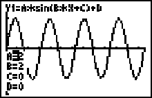

## Texas Instruments
### License Activation Center
A portal for users to activate their application licenses.

#### [activation.ti.com](https://activation.ti.com)

### Angular Web App
* Angular SPA allows users to 
    * Enter an activation key
    * Set up a license period
    * Activate a license

### Java Spring Boot 
Middleware that provides endpoints to  communicate with an Oracle database
* Validates key code format
* Validates key code in database
* Calls database to activate key code, providing product entitlement

## TI-84 Plus CE Online Calculator
An evolution of the TI-84 Plus CE Chrome App's angular application (see slides to the right) provides access to an emulator for the TI 84 Plus CE calculator on web browsers. 

#### [TI-84 Plus CE online calculator](https://84plusce.ti.com/)
> Requires Chrome browser on a desktop/laptop

### Angular Web App
Implemented UI features like screen capture

Implemented single-sign-on (SSO/OAuth) for user authentication and license entitlement via 3rd party provider.

## Texas Instruments
### Nspire Connect
Allows users to send and receive files to/from their TI-Nspire CX II calculator.

#### [Nspire Connect](https://nspireconnect.ti.com)
> TI-Nspire CX II calculator required

### Angular Web App

This UI/presentation layer was developed using Angular with material design elements.

* Integrated the library (see below) that provides calculator communications.
* Implemented UI features as angular components and guards.

### Server Configuration

Investigated and applied Tomcat and Apache Web server configuration changes to comply IT security requirements.

### Communications Layer
Wrote JavaScript and C glue layers for the cross-compiled NavNet Communications library

## Texas Instruments
### TI-84 Plus CE Chrome App
In reaction to the covid pandemic, led the team that worked to _support remote learning_ on Chrome OS allowing students to have a TI calculator.

Before EOL, the application had been used by over 3.5 million users.

### Angular Web App

This UI/presentation layer was developed using Angular with material design elements.

The responsive reflows for this app was purposely designed with Chromebook' typically small screen resolutions.

## Texas Instruments
### TI Connect For Chrome OS
Ported the CARS communication for an application that talks to TI calculators using Chrome's USB API. Implemented user-facing features in AngularJS in combination with Chrome APIs.

#### [TI Connect For Chrome OS](https://education.ti.com/en/products/computer-software/ti-connect-ce-chrome-os)

## Texas Instruments
### TI Connect CE
JavaFX desktop application that provides the ability to send and receive files from a TI Calculator. 

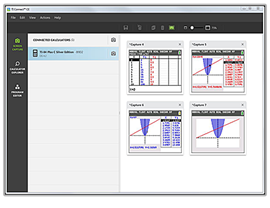

#### [TI Connect CE](https://education.ti.com/en/products/computer-software/ti-connect-ce-sw)

### Java Native Interface + USB

Provided JNI coding guidelines to avoid data corruption and maintainability issues. 

Delivered cross-platform compatibility for the CARS communication protocol by porting the codebase to generate DLL/dylib (Windows/macOS) files. 

## Texas Instruments
### TI SmartView

A JavaFX desktop application that provides teachers with an emulated calculator to create content as well as share with their classroom.

#### [TI SmartView CE](https://education.ti.com/en/products/computer-software/ti-smartview-ce-for-84)
#### [TI SmartView MathPrint](https://education.ti.com/en/products/computer-software/ti-smartview-30x-mp)

### TI SmartView
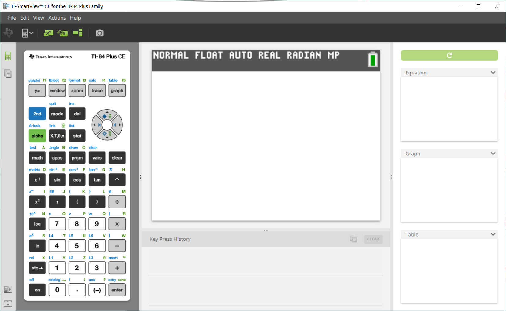

### Emulator Integration
Designed and implemented the glue code to communicate with the emulated calculator inside a web view.

### Emulator Performance
Co-led the team to make improvements to emulator performance while in a Java web view. 

Performed multiple micro-optimizations and critical path optimizations to improve performance.

### Statefiles
Designed file format for saving an emulator's state to disk.

With this feature/file, a user can save a serialized snapshot of the emulator to share with students or for class preparation.

### View3

Designed and implemented an approach to achieve multiple graph representations (right side, image above) by using:
* A pared down statefile (see above) to create a "save point"
* Key presses to change to the appropriate screen

## Texas Instruments
### ExamCalcs
A set of TI calculator emulators that are approved for use on *ACT®, SAT®, and AP® exams*, as well as most *state assessments.*

On their first soft-launch, pilots involving 800k users were done without any reported issues. 

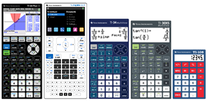

### TI 84 Plus C/Silver Edition

    

        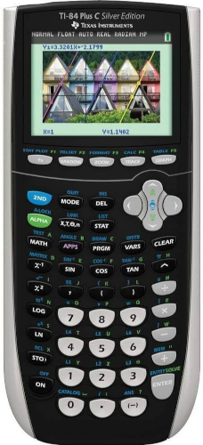
    

    

        <ul>
            <li>Took over the emulator provided as "quick code" by one of the local experts.</li>
            <li>Implemented mouse and keyboard inputs for all keys on keypad.</li>
            <li>Made improvements to performance and code cleanliness.</li>
        </ul>
    

### TI30XS-MV, TI-108
Ported device emulation from different sources including Java, C/boost and Flash/ActionScript implementations.

Implemented their appropriate JavaScript/CSS interactions for mouse and keyboard inputs.

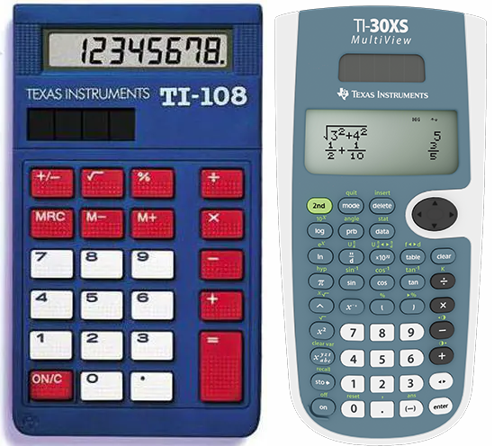

### TI 84 Plus CE ExamCalc

    

        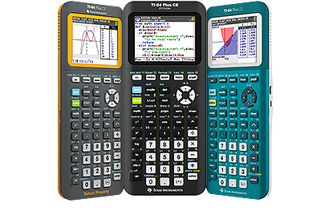
    

    

        Extended the z80 emulation to support the ez80 processor and the TI-84 Plus CE's new ASIC, in close timing to the physical calculator's development.
    

### CE ExamCalc Accessibility
Implemented  code needed in both z80 assembly and javascript to provide screen readers attached to the browser descriptive text for the state of the emulated calculator.

### Accessibility For Scientifics
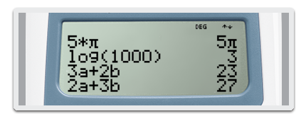

Implemented an OCR algorithm to translate screen contents from the calculator to text that an attached screen reader can voice.

### TI-36X Pro

    

        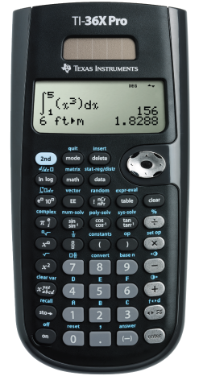
    

    

        Implemented Lapis MCU and associated hardware emulator in TypeScript in parallel with the embedded team's development of calculator functionality.
    

## Digital Chocolate
#### Game Engineering Manager

Coordinated project planning for various carriers in the US, working in conjunction with the sales and marketing teams to reduce production costs and improve revenue. Lead and mentor the engineering team, offering tutorials and code deep-dives where needed.

### Brew In App Purchase Library
Created client module for Qualcomm's Application Value Billing API (C/C++) in conjunction with the team in Bangalore, India. Allowing games to have in-app-purchases as well as promoting code reuse on future game titles

### Star Invasion

    

        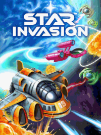
    

    

        <ul>
            <li>Porting for small-screened and resource limited devices. </li>
            <li>Development done in J2ME</li>
            <!-- <li></li> -->
        </ul>
    

### Rollercoaster Rush for iPhone
Ported iPhone implementation of OpenGL ES game to Qualcomm's Brew framework.

## LemonQuest

iPhone Programmer, coordinated with UI and game designers to create interactive and addictive experiences.

### iPhone Programmer
#### Circulate and Circulate Prologue

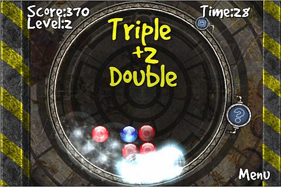

### iPhone Programmer
#### Circulate and Circulate Prologue
Ported the DirectX implementation to the iPhone's OpenGL ES. Game used every user-friendly feature on the iPhone, including it's 3d sound capabilities with Open AL and it's accelerometer. This game earned a bronze medal from pocketgamer.co.uk.

### Tool Programmer
Aided in the development of a stage editor for a game, done in Java.

### iFit
Wrote and application that provided pedometer functionality as well as fitness tips for the iPhone

## Gameloft
### Blockbreaker for iPhone

    

        
    

    

        <ul>
            <li>Developed and ported first prototype for the brick-breaker game using the Celestial framework for iPhone. </li>
            <li>Used C-implementation for OpenGL ES as graphics engine</li>
            <!-- <li></li> -->
        </ul>
    

### 3d Programmer

    

        
    

    

        <ul>
            <li>Ported 3d game titles for resource-limited, but 3d-capable devices. </li>
            <li>All ports used Java's JSR184 3d implementation</li>
            <!-- <li></li> -->
        </ul>
    

### Bikini Volleyball Mini Games

    

        
    

    

        <ul>
            <li>Implemented mini-games that fit into high-end devices.</li>
        </ul>
    

### Virgin Mobile Team Lead

    

        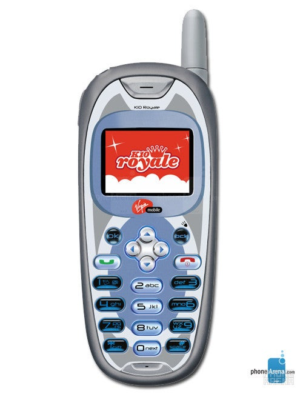
    

    

        <ul>
            <li>Ported games to Virgin Mobile's catalog of space-constrained devices.</li>
            <li>Acted as team lead helping members where needed</li>
            <!-- <li></li> -->
        </ul>
    

<!-- GENERATED CONTENT -->
<!-- ## Texas Instruments
### Open Source Auditing -->
<!-- ## Texas Instruments
### Tech Sync Coordinator -->
<!-- ## Texas Instruments
### Automated Test Framework Prototype
Prototyped automation framework for interacting with calculator libraries in the browser using Node.js, CucumberJS, Mocha and Selenium Web Driver. -->
<!-- 
## Texas Instruments
### Document Display Standardization
Given the strong desire for documents to display with the same word-wrapping and character counts on all supported devices (iPad being a new addition): researched and developed guidelines and layout rules for document rendering when being displayed on different screen resolutions. -->
<!-- ## Texas Instruments
### Nspire Desktop
### Image Question Type
Designed and implemented the infrastructure for creating new classroom activities using the Lua scripting language. The C counterpart for the Lua bindings, as well as the Lua engine itself gets cross-compiled to run on different platform including iOS, Nucleus and desktop operating systems.
### Image Question type
Designed and implemented some of the infrastructure necessary to create new classroom activities using the Lua scripting language. The C counterpart for the Lua bindings, as well as the Lua engine itself gets cross-compiled to run on different platform including iOS, Nucleus and desktop operating systems. The use of Lua would open up the possibility of expanding TI-Nspire's question types in the future without needing to write them in Java
### UI And Background Thread Refactor
Worked in conjunction with the development team to refactor the usage of JNI, improving performance and memory usage. -->