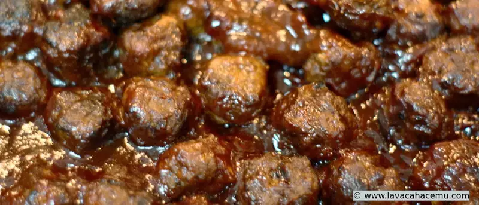
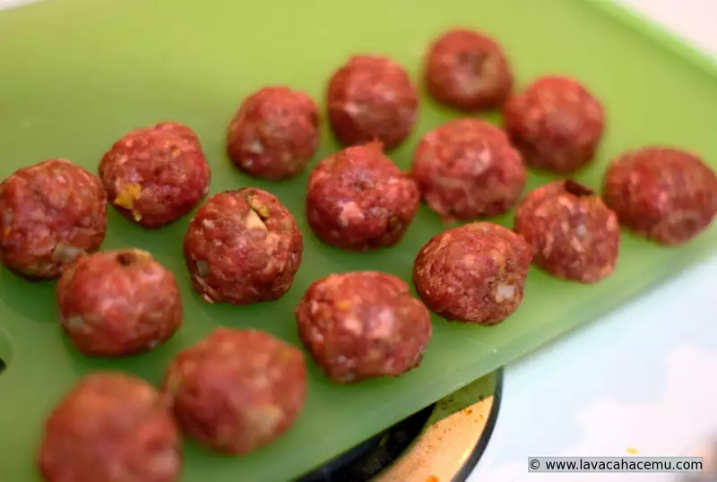
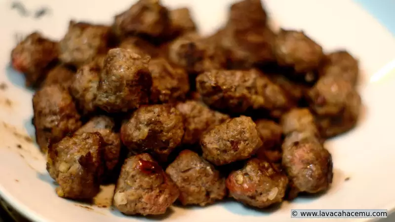
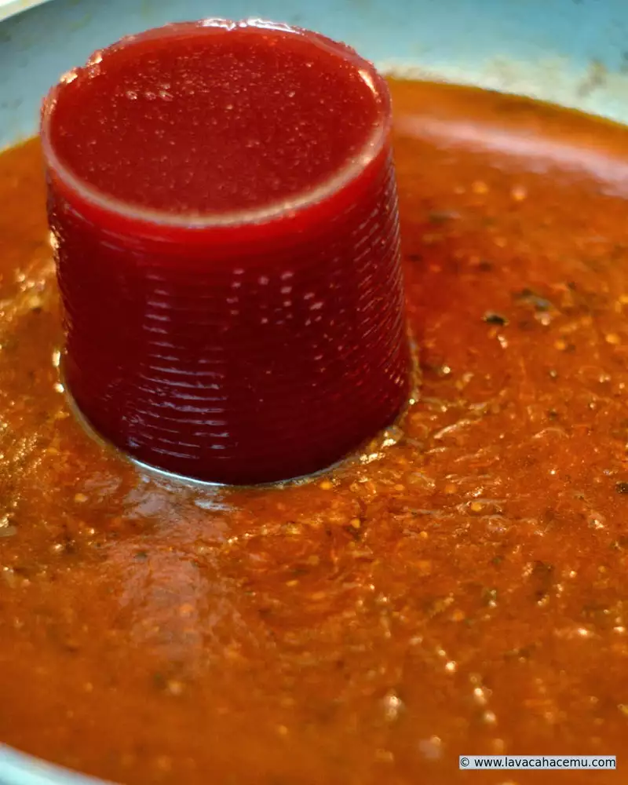
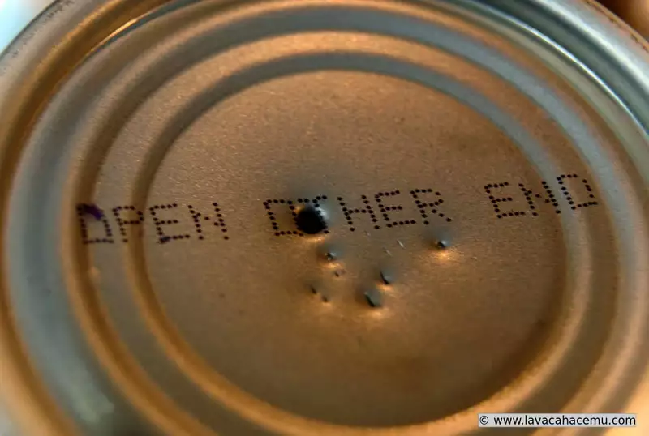

  

JA! esta receta la provee heinz!! bueno, la versión de ellos es muy... em.. "_práctica_" (<-- nótese el doble énfasis :P) pero la receta originalmente la saqué de un post en reddit, donde usan la misma :| receta de Heinz... oh well.. pero ellos se creen taaaaan creativos!! 'ches goebones también.. cómo que con albóndigas compradas? bueno, debo admitir que para esta ocasión consideré comprar congeladas y hacer la receta tal como la indica Heinz.. pero.. nee, muy poquitas en el paquete y pues, un tanto caras.. haciéndolas en casa fácil hice como 3 veces más y como se obtienen los "restos" de donde se doran, la salsa queda más sabrosa. La primera vez que hice estas fue en Navidad que nos invitaron a la casa de unos amigos a pasar un rato con ellos antes de la cena de Nochebuena; esa vez lo que admito que me falló es que hice las albóndigas muy grandes y más que 

###  Ingredientes

#### Para las albóndigas

2 lb carne molida  
1/2 cebolla mediana finamente picada  
1 cda salsa de chipotle  
1 ~ 2 chipotles  
1/2 cda mostaza  
1 huevo  

#### Para la salsa

1 botella de [chili de heinz](dcs-809b_1z-original.webp)  
1 lata de salsa de arándanos  
1~2 chipotles  
1/2 tz cerveza  
  
Procedimiento  
  
Mezcla todos los ingredientes de las albóndigas y.. _haz albóndigas_ de apróximadamente 2 cm.  
  

Dóralas en un sartén, procurando no sobrecargarlo  

Una vez doradas, retíralas  
Sin regresar al  fuego, agrega la cerveza al sartén para deglasearlo  
Una vez deglaseado, agrega la salsa de chiles y la de arándanos  

Claro, después de mentársela a la lata moderna porque no se puede abrir de abajo para sacarle la salsa fácil... si, lo que haces es picarlas con algo... como un sacacorchos :P  

Una vez incorporada la salsa, regresa las albóndigas a la salsa y déjalas terminar de cocerse un par de horas.  
Sirve con picadientes y apúrale a comer, que se acaban!
