Después de un par de horas, o tal vez un poco menos después de que pasaron los [trophies](https://ww.lavacahacemu.com/baja-1000-trophy-trucks-carreras_original.html), por fin se escucharon los helicópteros, para la baja, al igual que para cualquier carrera no-de-circuito, la anticipación del primer carro, mas bien, la desesperación de que pase el primer carro es algo casi no-apto para cardiacos.. pasan helicópteros, cuando las condiciones están secas y andas más en el monte que en una ciudad (como aquí), se ve a lo lejos la nube de polvo, si estás en algún cañón, el eco del motor rugiendo mientras se aproxima, finalmente se oye a lo lejos claramente el motor y derrepente, AHI VIENE UNO! empiezan a gritar (también, si es que hay gente) y en ese momento... cámara:ON... se alcanza a ver por primera vez y al menos en mi caso, es cuando se empieza a oir , , , ,  de la cámara; cuando ya está cerca te alejas del camino y pasa el carro acelerando mientras va, te cubres del polvo, tierra y piedras que seguramente habrá arrojado hacia tí. Y.. en el caso de la baja... repite las veces necesarias hasta que se acaban los carros :D.

  

[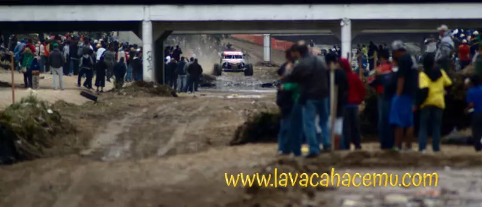](DSC09247fw-original.webp)

 Y así comenzaron a pasar los carros, ahora sí, a velocidad de carrera, no escoltados.  

[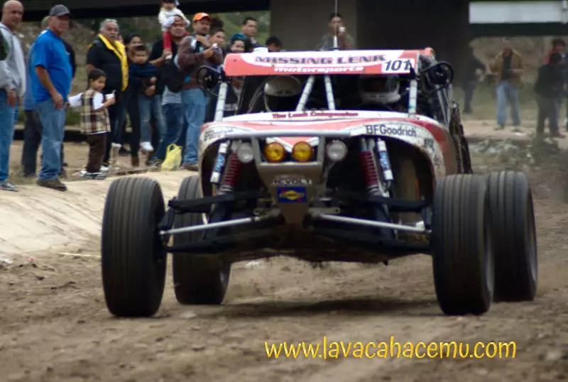](DSC09251fw-original.webp)

  

[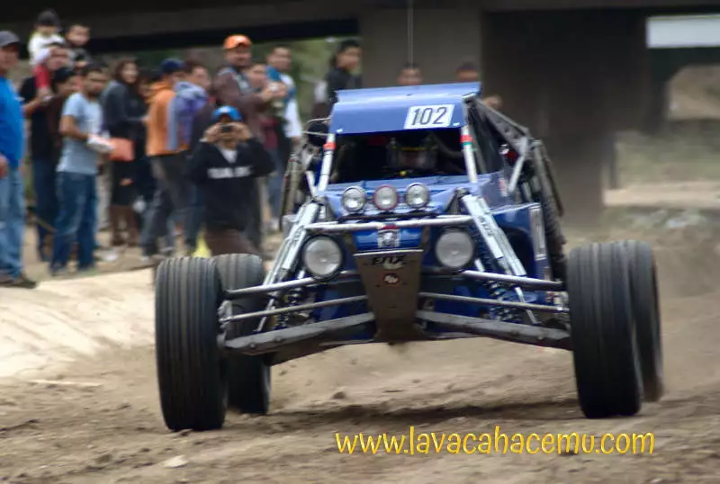](DSC09254fw-original.webp)

  

  

  

[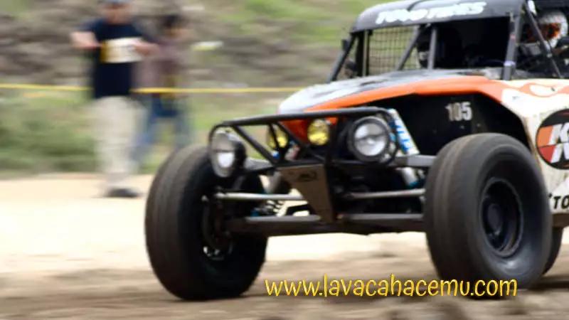](DSC09261fw-original.webp)

  

  

  

[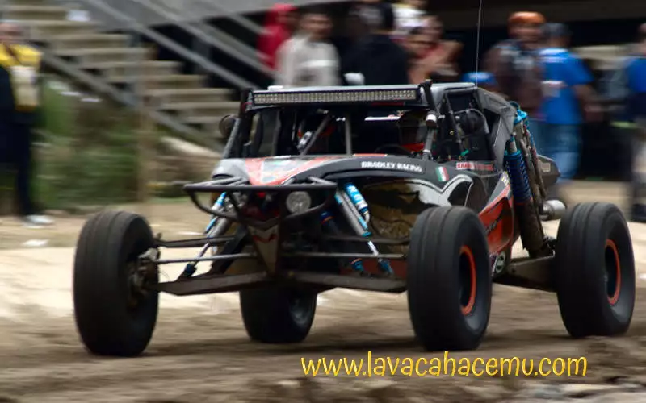](DSC09269fw-original.webp)

  

[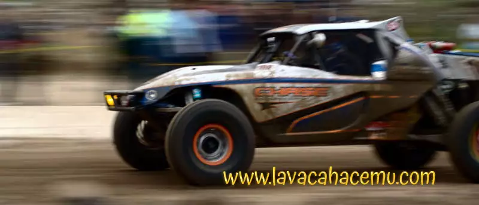](DSC09273fw-original.webp)

  

[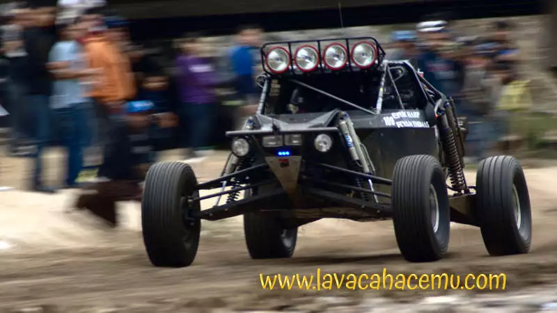](DSC09275fw-original.webp)

  

[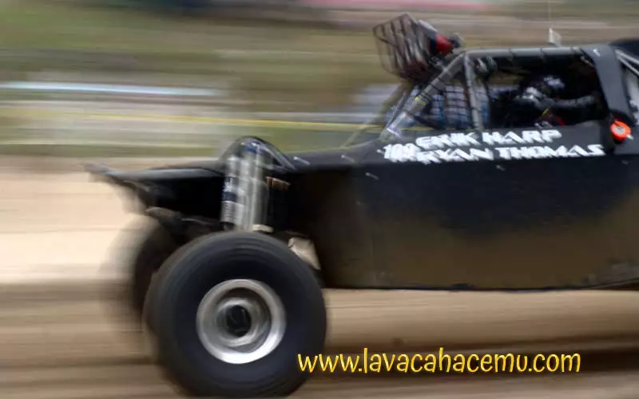](DSC09277fw-original.webp)

  

[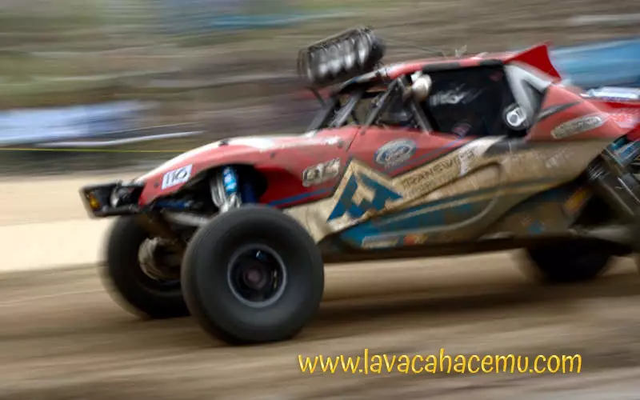](DSC09281fw-original.webp)

  

[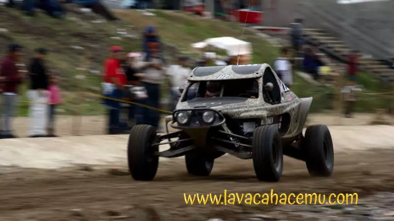](DSC09283fw-original.webp)

  

[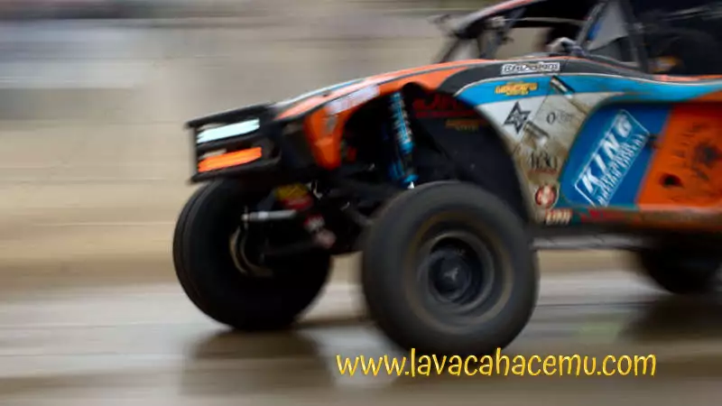](DSC09287fw-original.webp)

  

[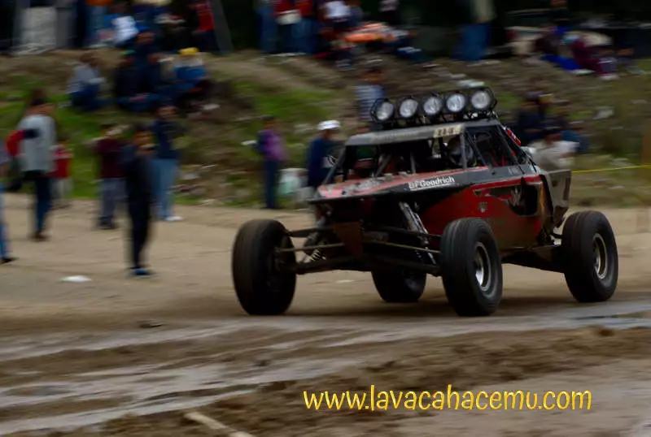](DSC09289fw-original.webp)

  

[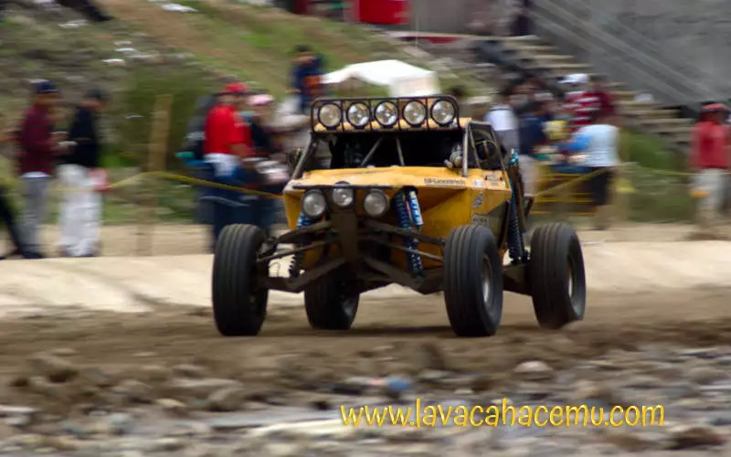](DSC09293fw-original.webp)

  

[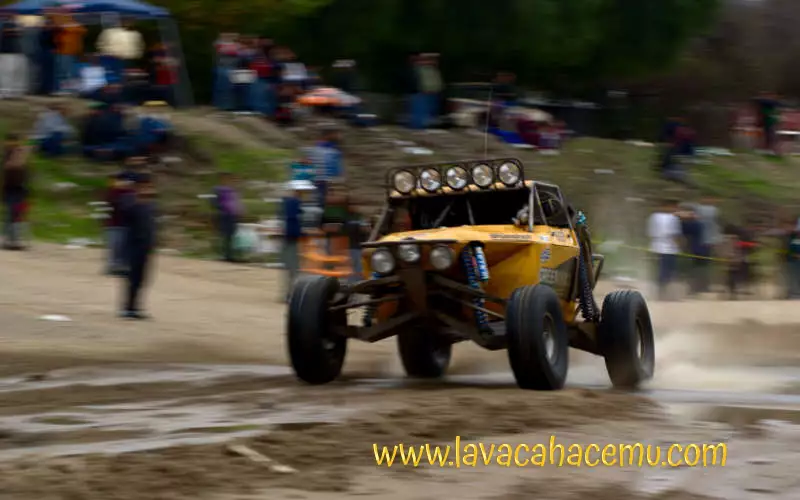](DSC09295fw-original.webp)

  

  

[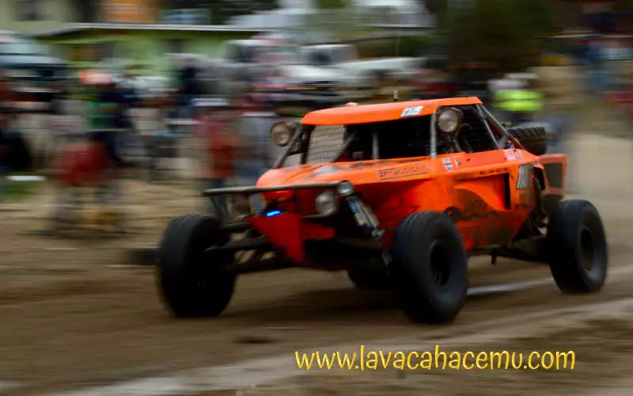](DSC09308fw-original.webp)

  

[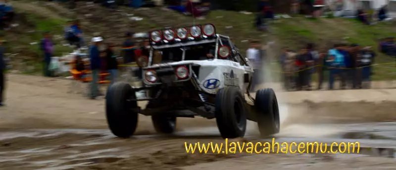](DSC09312fw-original.webp)

  

[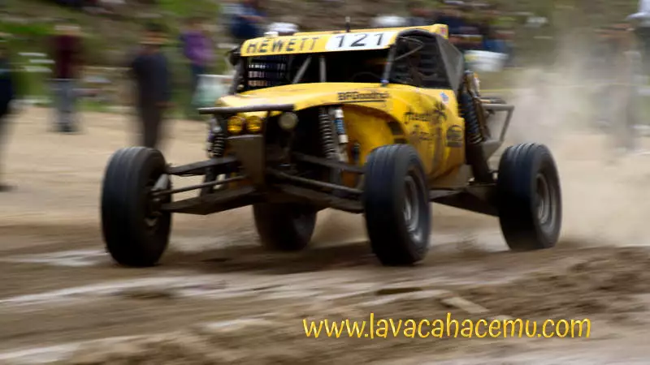](DSC09315fw-original.webp)

  

  

[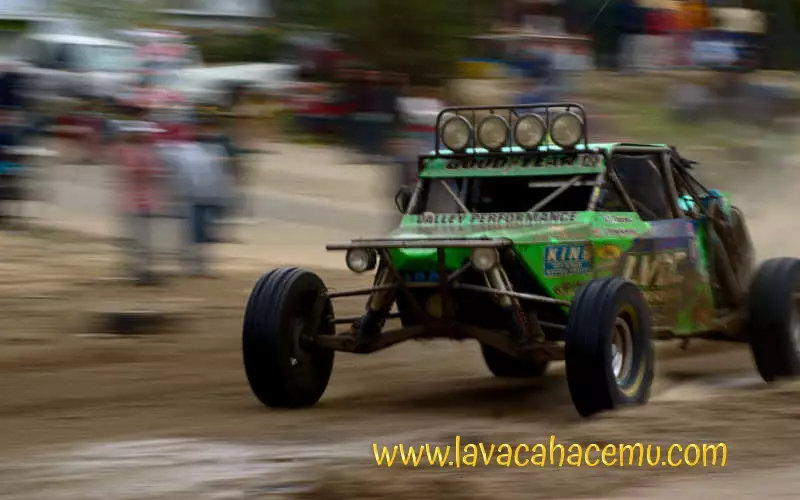](DSC09320fw-original.webp)

  

[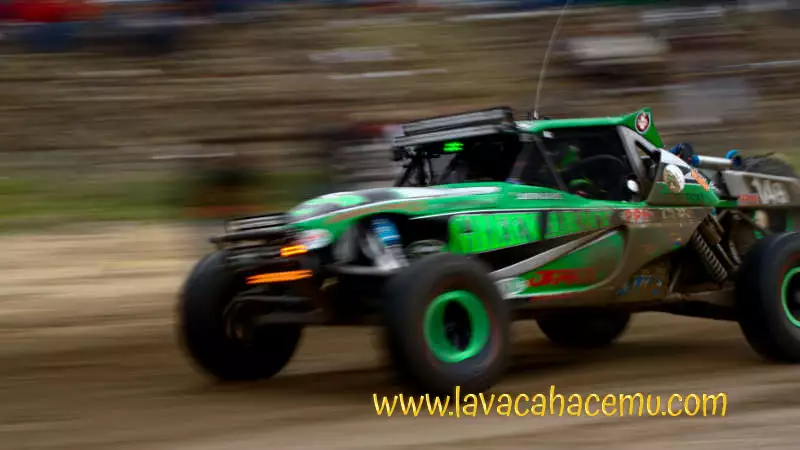](DSC09325fw-original.webp)
