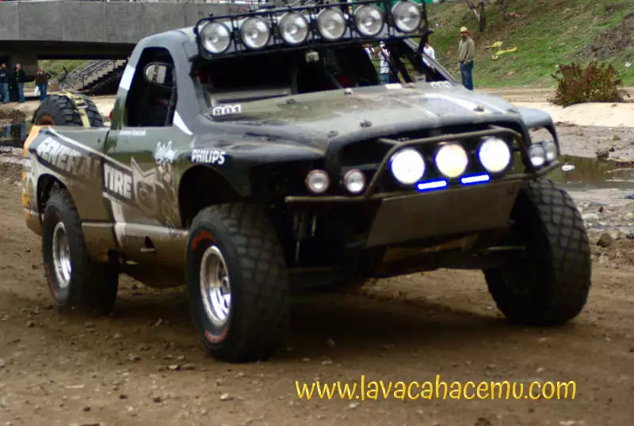
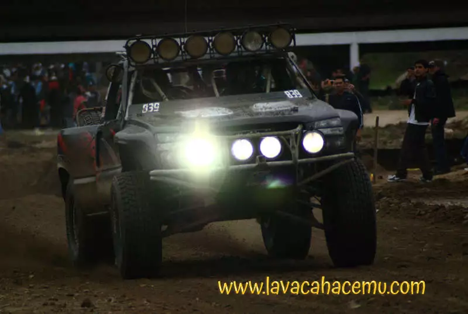
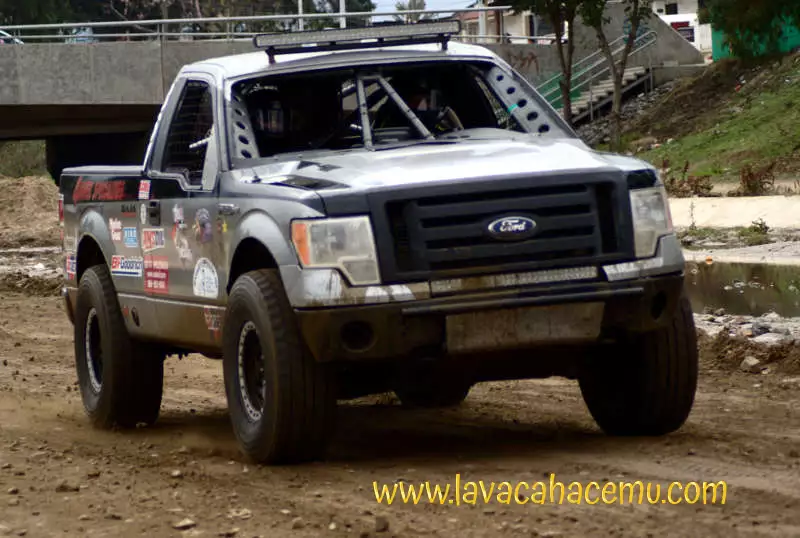
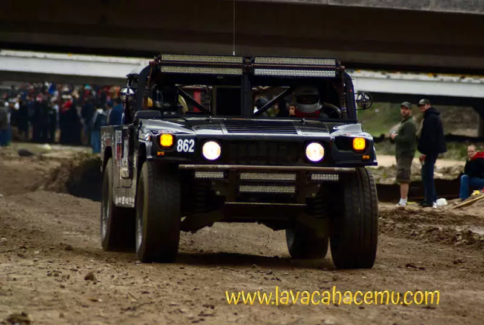
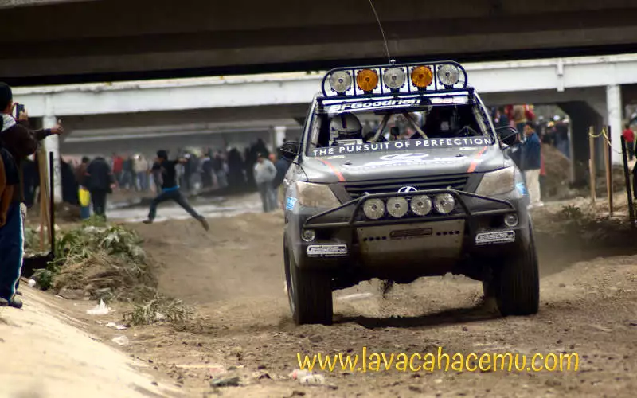
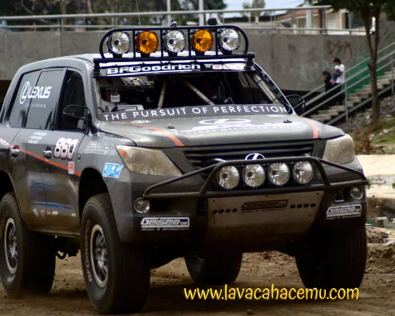

Érase una vez una baja 1000.. o tal vez era una 500 en que me llevó mi hermano a ver los carros; como de costumbre, nunca me quedé del todo quieto y como desde entonces quería tomar fotos de los carros :D, claro que con una cámara de rollo de 110mm (si, así de viejo soy)... se me ocurrió ponerme frente a unas ramas donde se separaba el camino... nunca se me pudo ocurrir que vendrían 2 de estos monstruos ruidosos (creo que son los que más ruido hacen de todos, CREO que son v8 sin turbo) y que a uno de llos se le ocurre cortar camino.. CASI encima de donde estaba yo parado tomando fotos... sigo aquí, sigo entero.. no pasó nada y aprendí la lección de no ponerme donde puedan pasar los carros, sigo parandome mas cerca de lo que te dejan en... digamos, la WRC.. pero para nada como esa vez.

  

  

  

  

  

