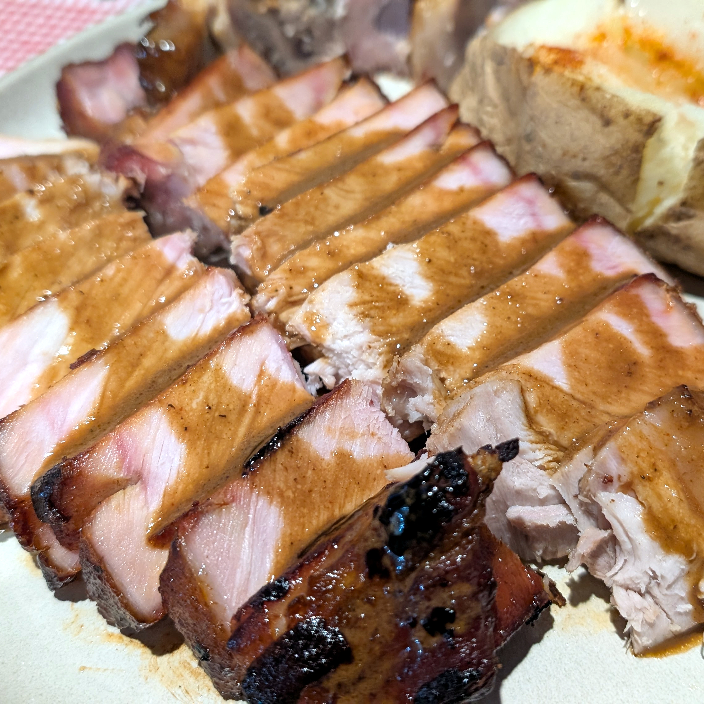

Al escribir este post estoy tratando de decidir hasta qué nivel de detalle llegar con la receta, porque.. pues.. si es tooodo el detalle, está canijo y termino sintiéndome como el de <a href="https://www.vice.com/wp-content/uploads/sites/2/2018/04/1523465336072-Screen-Shot-2018-04-11-at-120751-PM.png"> este meme</a>... pero si no describo toda la receta desde comprar la carne hasta que se pone en el plato siento que no estoy haciendo bien mis labores. 

Bueno, ok... sin cantidades exactas porque, ps no me acuerdo :P ... 

La carne es de sam's comprada en trozo de costillas con espinazo así:

