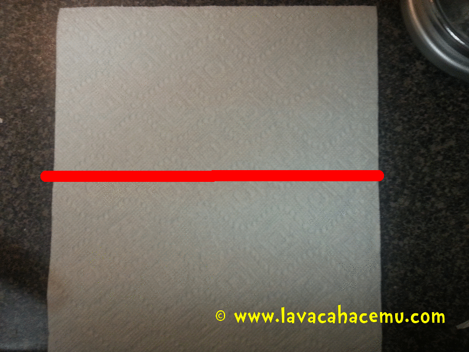

Crepas, ah, la querida crepa. Tan simple, pero a la vez tan difícil de queden _bien_. En mi mente, una crepa es un poco dulce, no tanto como para que no sepa buena con jamón y queso; y también salada, pero no como una galleta salada, de tal manera que haga buen maridaje con algo como nutella, plátanos o hasta con una mermelada. Además del sabor, también es de suma importancia la textura así que las crepas deben tener un crujor delicado, pero no al grado de, digamos, un cono de nieve.

Aquí les comparto la receta de Julia Child (receta al final del artículo): 

Comienza agregando 2/3 de taza de leche a un refractario

Agrega 2/3 de taza de agua

  
Ahora 1/4 de cucharadita de sal

  
3 huevos enteros

  
Bate hasta que quede homogéneo

  
Agrega 1 taza de harina y.. bate

  
Vamos a necesitar 3 cucharadas de mantequilla (puedes usar la graduación que viene en la envoltura para medir)

  
Derrite la mantequilla, de preferencia en el sartén donde vas a hacer las crepas, así ya queda engrasado. En este caso usé el sartén de fierro pesado por la retención de calor que tiene :).

  
Agrega la mantequilla al batido, pero con lo que se queda en el sartén, a mí me gusta doblar una servilleta en octavos: 

  
Con esa servilleta re-engrasa el sartén entre tandas de crepas así que no lo tires!

  
shiny!  

  
ya que agregaste la mantequilla derretida, mezcla hasta que qude homogéneo. En este momento puedes dejarlo como está hasta por 2 ~ 3 días en el refri. Además, las crepas se pueden hacer por adelantado y cuando vas a servir ya solamente te queda la tarea de rellenarlas.

Qué te parece si hablamos de rellenos?

Las fresas son MUY populares en esta casa, y con lechera, más!

Así como la cajeta

  
Ahora, cuando hagas las crepas, asegúrate de que se distribuya la masa por todo el sartén

Tiene que haber suficiente para llegar a todas las orillas

Si la movida del sartén no se te dá, puedes usar el cucharón para distribuirlo.

Dale vuelta cuando se haya dorado de un lado

Si no se deja separar de sartén muy fácilmente empieza a meter una espátula poco a poco alrededor

Y comienza a rellenar, a mí me gusta doblar en cuartos, así que rellena el primer cuadrante  

Luego dobla la crepa dos veces, para que quede 1/4 de la circunferencia  

Emplata y embellece

Ahora bien, no te deberías limitar a crepas dulces. Esta es una razón por su versatilidad, échale... no se, un poco de queso y flor de calabaza?

  
O espinacas

  
O... pepperoni y mozzarella para hace un hotpocket casero!

  
Bastante bueno el invento, por cierto!

