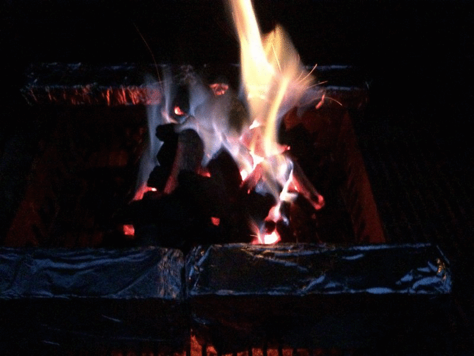

  
Yakitori (焼き鳥, やきとり, ヤキトリ) in it's most basic form is simply skewered chicken, although in japanese tradition, there's variations for what proteins and even vegetables you skewer and grill. One can choose to get sweet-salty _tare_ or teriyaki sauce or plain ol' salt.  
  
On this occasion, we'll be making chicken yakitori with pimentos and onions and with tare.  
  
In this post, aside form the the usual recipe we'll also go through how to set up your grill and light up coals, in fact, this post will be more about lighting the grill than the food.  
  
Let's start setting up the grill. First, you'll need to wrap some bricks in aluminum foil and place them on the charcoal rack of your grill, in this case, we won't be using the cooking grates, so you can remove them.  
  

  
Now, lay down some charcoal, I like making a hollowed out tower, like [this](fuego.html)  

  
 Now, throw in some napkins or pieces of paper that have been soaked lightly in oil and light, as each piece starts to die off, add another; usually 2~3 is going to be enough, but add as needed until the fire is self-sufficient.  

  
A happy fire..  

  
 Blue flame!  

  
Now spread that charcoal around, in this instance, I added a little bit more and let them turn to embers which was way too much for what we needed to cook 6 skewer's worth of chicken and it was just way too hot.  

  
So, after a quick sear on both sides, I removed the yakitori and pushed part of the embers to one side so I could make sure I finished cooking the chicken on the low-heat side.  

  
The finished product, charred, caramelized and beautiful

  
Served over some brown jasmine rice, extra sauce optional.  

Sources

1.  http://www.bonappetit.com/columns/obsessivore-columns/article/i-m-big-on-japan
2.  Yakitori
3.  http://www.japan-guide.com/r/e102.html
