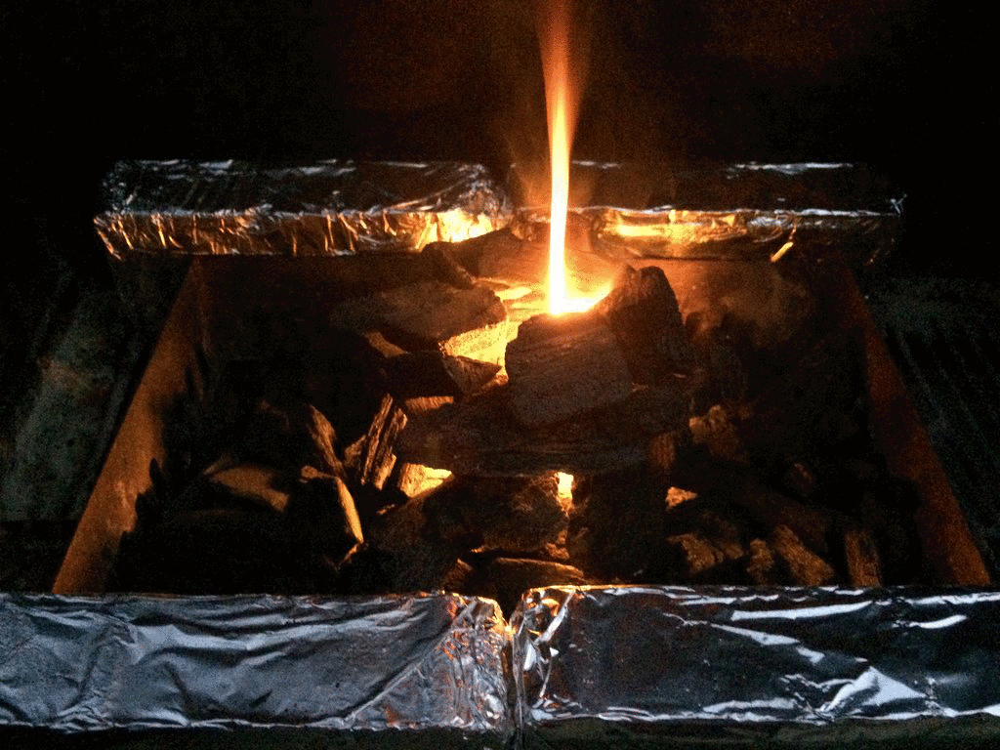
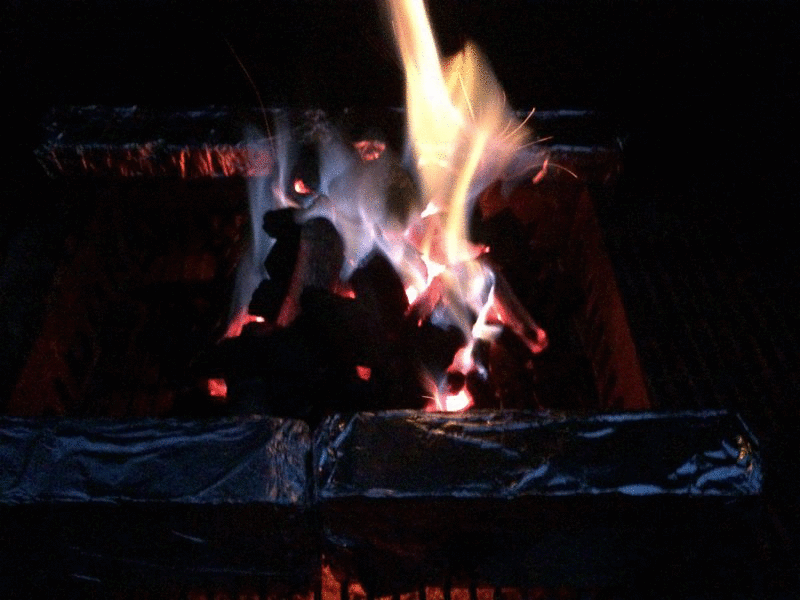

  
Yakitori (焼き鳥, やきとり, ヤキトリ) en su forma más básica son brochetas de pollo, aunque como buena tradición japonesa, hay variaciones según preferencia y según la región. Se pueden usar diferentes tipos de proteína y vegetales así como la elección entre sazonar con sal o con salsa tare, coloquialmente conocida como salsa teriyaki, al menos en Norteamérica.

En esta ocasión estaremos haciendo yakitori de pollo con pimiento, cebolla y salsa tare. En este post, además de la receta, o pseudo receta, estaremos concentrando nuestra atención a una parte mas importante que el pollo o la salsa: el fuego! y el respectivo acomodo para hacer las brochetas de forma un poco mas "tradicional".

Comencemos con acomodar el asador. Como son brochetas, dependerá de la longitud de las que tengas y de la cantidad que vayas a hacer, para 2 personas habría sido suficiente con un ladrillo de cada lado pero soy impaciente :). Los ladrillos van forrados en papel aluminio para que no se encochambren; estos se colocan a una distancia tal que se pueda poner una brocheta entre ellos y que quepa la comida sobre el fuego.

Ahora coloca unos trozos de carbón en una torre cilíndrica, más o menos así: this

Échale unas servilletas previamente humedecidas en aceite y enciéndelas. Normalmente con 2 o 3 son suficientes para que se mantenga solo el fuego, pero échale las que sean necesarias hasta que se mantenga.

Un fuego feliz (no creo que Bob Ross lo haya dicho alguna vez)

Flama azul!... Con carbón!

Ya que estén bien encendidos los carbones, desparrámalos en el fondo del asador. Admito que le calculé mal y le eche más carbón al desparramar y ... No, mala idea.. tuve que hacer a un lado al menos una parte para evitar que se me quemara el pollo!

Si, digamos que lo configuré como "lado caliente" lado .. "menos caliente"

Producto terminado, poquito quemado el azúcar de la salsa.

Sobre arroz integral :D

Fuentes

1.  http://www.bonappetit.com/columns/obsessivore-columns/article/i-m-big-on-japan
2.  Yakitori
3.  http://www.japan-guide.com/r/e102.html
